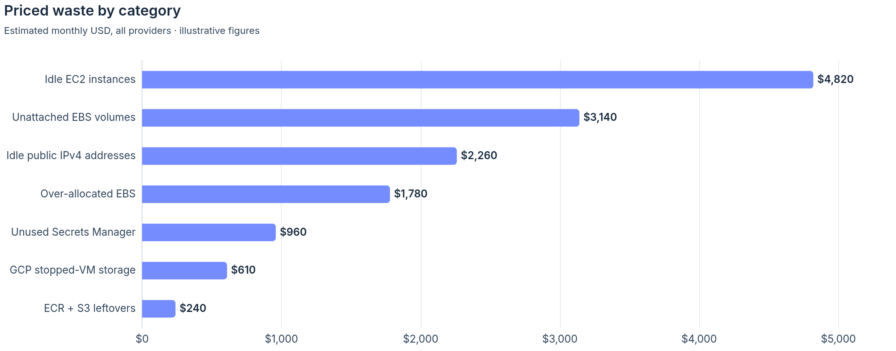
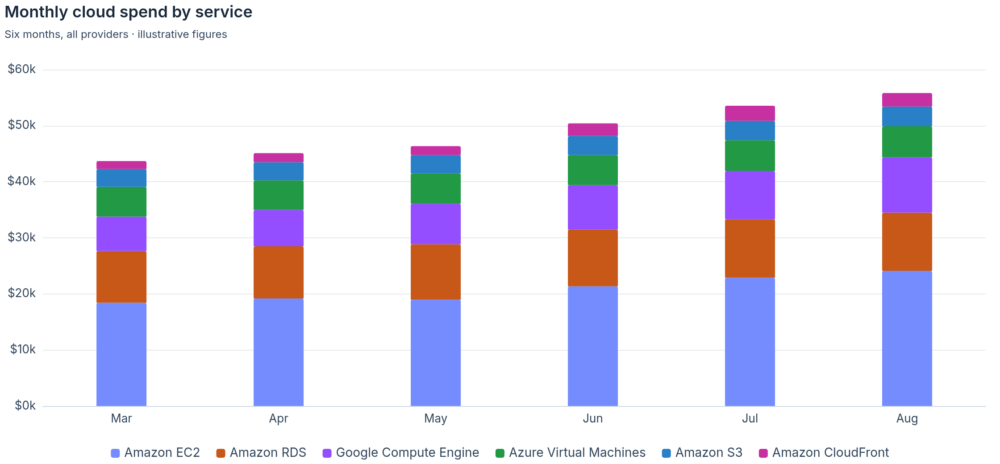
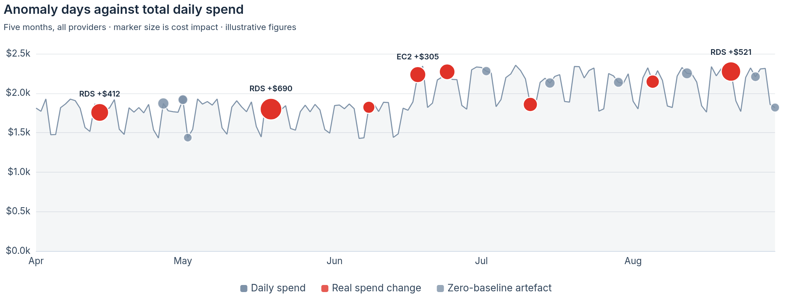
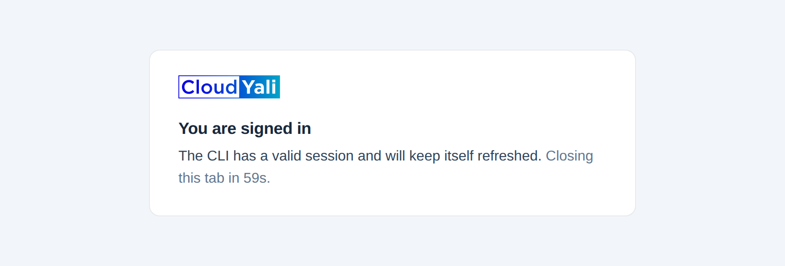

# CloudYali MCP server

Ask your cloud bill a question, in the assistant you already use.

This is an [MCP](https://modelcontextprotocol.io) server that exposes the
[CloudYali](https://cloudyali.io) API — cost reports, budgets, savings
opportunities, anomalies, tag governance and resource inventory — as **31 typed
tools** for Claude and other MCP-capable clients. Browser sign-in with automatic
token refresh, and **read-only by construction**: no write endpoint is reachable.

It runs as a local process on your machine. Your cost data goes from CloudYali's
API to your MCP client and nowhere else — there is no CloudYali-hosted MCP
service in the path.

> *"Find everything we're paying for that nobody is using — idle, unattached,
> over-allocated or forgotten, across every cloud. Pure waste only: exclude
> rightsizing and commitment recommendations. Price what can be priced."*

<picture>
  <source media="(prefers-color-scheme: dark)" srcset="docs/waste-by-category-dark.png">
  
</picture>

<sub>One question, answered across three providers by walking inventory, cost and
savings together — then charted in the CloudYali palette using the Apache ECharts
theme this server ships, so it matches the console rather than whatever the model
picks. Figures illustrative.</sub>

Requires a CloudYali account — sign in at
[console.cloudyali.io](https://console.cloudyali.io).

## What you can ask

**Spend**

- *"Break down last month's AWS bill by service."*
- *"Which five services cost us the most this month, across every cloud?"*
- *"Compare this month's spend to last month — what changed?"*
- *"Show daily GCP spend for June as a chart."*

<picture>
  <source media="(prefers-color-scheme: dark)" srcset="docs/spend-by-service-dark.png">
  
</picture>

**Saved cost views**

- *"What saved cost views do we have?"*
- *"Run the data-transfer view for the last 90 days."*
- *"Which resources are behind the EBS view's total?"*

A saved view is a question someone already decided was worth asking, and it
carries the whole-bill denominator — so answers come back as *"$4,200, a third of
the bill"* rather than a number with no scale.

**Waste**

- *"What are we paying for that nobody is using?"*
- *"Which unattached EBS volumes have been sitting there longest?"*
- *"Are any Elastic IPs allocated but not attached to anything?"*
- *"Break the waste down by category and price what can be priced."*

Nothing in the API answers this on its own. The assistant reaches it by crossing
inventory against cost against open savings findings — which is the shape of
question worth having an assistant for, and the reason the tools are typed rather
than one generic endpoint.

**Savings**

- *"What are our top savings opportunities right now?"*
- *"List open recommendations for EBS volumes worth more than $50/month."*
- *"How much would we save if we actioned everything currently open?"*

**Budgets**

- *"How are we tracking against our budgets?"*
- *"Which resources drove the production budget's spend in June?"*
- *"Has the data-transfer budget fired any alerts this month?"*

**Anomalies**

- *"Any cost anomalies in the last 7 days?"*
- *"Review every anomaly since April — which are real spend changes and which
  are detector artefacts? And did any of them actually reach anyone?"*
- *"Summarise anomaly count and cost impact for the quarter."*

<picture>
  <source media="(prefers-color-scheme: dark)" srcset="docs/anomaly-days-dark.png">
  
</picture>

Two things worth noticing in that picture, because both are the point. Anomalies
are plotted *against the spend line*, so a large marker on a flat stretch is
visibly not a spend change — an expected-cost-of-zero on a service that had been
billing daily is an artefact of detection, not something to escalate. And the red
is not a palette choice: it is the reserved `increase` colour, which means one
thing across every chart this server produces. The last clause of that prompt —
*did any of them reach anyone* — is `get_anomaly_alert_settings`, which reports
whether alerting is on and nothing about how it is wired.


**Tag governance**

- *"How much of last month's spend is untagged?"*
- *"What does everything tagged `env=prod` cost us?"*
- *"Is anyone spelling `Environment` three different ways?"*
- *"Which tag keys are one character away from our standard ones?"*

**Inventory**

- *"How many EC2 instances do we have, per region?"*
- *"Find every resource tagged `environment=prod` that is still active."*
- *"What did instance `i-0abc123` cost last month?"*
- *"What changed on this security group recently?"*

### Getting better answers

**Name a window when you care about one.** Otherwise sensible defaults apply,
usually the last 30–90 days.

**Ask what you can filter by before filtering.** *"What can I filter cost by, and
what values exist?"* runs `resolve_facets`, which returns the dimensions and the
values this account actually has. A misspelled filter value is not an error — it
returns an empty result that looks like a real answer.

**Read the warnings.** Some questions come back with a caveat above the number
rather than below it. That is deliberate: a caveat printed after a total is a
caveat about a number you have already believed. If a tool says two figures are
not comparable, they are not comparable.

**Spot-check anything that matters** against the console. The data is the same;
the assistant's aggregation choices may not be the ones you had in mind.

## Setup

Requires Node.js 20+ and git.

### 1. Get the code and build it

`npm install` also builds `dist/`, via the `prepare` script — there is no separate
build step. The last line checks that the build landed and runs the test suite.

**macOS / Linux**

```bash
git clone https://github.com/cloudyali/cloudyali-mcp-server.git
cd cloudyali-mcp-server
npm install
ls dist/index.js && npm test
```

**Windows (PowerShell)**

```powershell
git clone https://github.com/cloudyali/cloudyali-mcp-server.git
cd cloudyali-mcp-server
npm install
Test-Path dist\index.js; npm test
```

> **Not on npm yet.** Once published, the clone-and-build step disappears and
> every snippet below can use `npx -y @cloudyali/mcp-server` instead of
> `node <path>/dist/index.js`.

### 2. Register it with your MCP client

Use the **absolute path** to `dist/index.js` from step 1.

**Claude Code**

```bash
claude mcp add cy -- node /path/to/cloudyali-mcp-server/dist/index.js
```

```powershell
claude mcp add cy -- node C:\path\to\cloudyali-mcp-server\dist\index.js
```

> **Tip:** the name you register becomes the tool prefix (`mcp__cy__query_costs`).
> A short name like `cy` keeps tool names readable. The tool descriptions
> recognise "CloudYali", "cy" and "cloud cost", so the assistant finds them from
> natural phrasing either way.

Run `/mcp` to confirm `cy: connected`. The version string reports the live tool
count — `0.1.0 (31 tools)` — so a server that is running stale code is visible at
a glance.

**Claude Desktop** — add to `claude_desktop_config.json`
(Settings → Developer → Edit Config; the file lives at
`~/Library/Application Support/Claude/claude_desktop_config.json` on macOS and
`%APPDATA%\Claude\claude_desktop_config.json` on Windows):

```json
{
  "mcpServers": {
    "cloudyali": {
      "command": "node",
      "args": ["/path/to/cloudyali-mcp-server/dist/index.js"]
    }
  }
}
```

On Windows, wrap with `cmd /c`:

```json
{
  "mcpServers": {
    "cloudyali": {
      "command": "cmd",
      "args": ["/c", "node", "C:\\path\\to\\cloudyali-mcp-server\\dist\\index.js"]
    }
  }
}
```

Restart Claude Desktop after editing the config.

**Other clients** — this is a standard stdio MCP server, so it runs in any client
that launches local MCP servers. Most (Cursor, Gemini CLI, Cline, Windsurf, …)
accept the same `mcpServers` block as Claude Desktop. Two common ones differ:

*OpenAI Codex CLI* — TOML in `~/.codex/config.toml`
(`%USERPROFILE%\.codex\config.toml` on Windows):

```toml
[mcp_servers.cloudyali]
command = "node"
args = ["/path/to/cloudyali-mcp-server/dist/index.js"]
```

*VS Code* — `.vscode/mcp.json`, where the top-level key is `servers`:

```json
{
  "servers": {
    "cloudyali": {
      "command": "node",
      "args": ["/path/to/cloudyali-mcp-server/dist/index.js"]
    }
  }
}
```

> **Web-based hosts** (ChatGPT, claude.ai in the browser) cannot spawn a local
> process, so they cannot use this stdio build. That would need a remote HTTP MCP
> server, which is a separate deployment and not available today.

### 3. Sign in

On your first data call you will be prompted to authenticate. Run the **`login`**
tool — or just ask the assistant to *"log in to CloudYali"*. It:

1. Opens your browser to the CloudYali console's authorize page, behind the normal
   sign-in including MFA and SSO.
2. Shows a short **verification code** — authorize only if the browser shows the
   same code.
3. Saves a refresh token to `~/.cloudyali-mcp/credentials.json`
   (`%USERPROFILE%\.cloudyali-mcp\credentials.json` on Windows), created with mode
   `0600` on macOS and Linux and protected by your profile's ACLs on Windows.

<picture>
  <source media="(prefers-color-scheme: dark)" srcset="docs/login-signed-in-dark.png">
  
</picture>

That page is served by this repo, not the console, from a listener on localhost.
It closes itself after a minute — and if the browser refuses to let it, it says
so, because a countdown that reaches zero and does nothing looks like a bug. You
can close it yourself at any point; the session is already saved.

Tokens refresh themselves; you will not sign in again until the refresh token
expires. They travel only in the browser URL fragment to a localhost listener —
never to a remote server or any server log.

**Headless alternative:** set `CLOUDYALI_JWT` to a Cognito access token to skip
the browser entirely.

## Tools

Thirty-one typed tools in eight areas. Each validates its own arguments, so a
bad value is rejected here with a message naming the argument rather than
arriving as an opaque 400 one layer down.

| Area | Tools |
|---|---|
| **Spend** | `get_spend_summary` · `query_costs` · `get_cost_breakdown` |
| **Filter discovery** | `resolve_facets` |
| **Saved cost views** | `list_cost_views` · `run_cost_view` · `get_cost_view_detail` |
| **Savings** | `list_savings_opportunities` · `get_savings_summary` · `get_savings_opportunity` |
| **Budgets** | `list_budgets` · `get_budget_summary` · `get_budget` · `get_budget_history` · `get_budget_resources` |
| **Anomalies** | `list_anomalies` · `get_anomaly` · `get_anomaly_summary` · `get_anomaly_alert_settings` |
| **Inventory** | `list_resources` · `search_resources` · `get_resource` · `get_resource_costs` · `get_resource_history` · `get_inventory_stats` |
| **Tag governance** | `list_tag_keys` · `list_tag_values` · `get_tag_coverage` · `get_cost_by_tag` · `get_tag_health` · `list_standard_tags` |

Plus `login` for browser sign-in.

The server also publishes four MCP resources: `cloudyali://design` (chart palette
and the artifact stamp), `cloudyali://echarts-theme` (the ECharts 5 theme object),
`cloudyali://brand-mark` (the logo as inline SVG), and `cloudyali://filters` (the
cost filter grammar, and the ways a filter fails quietly).

<details>
<summary>Raw catalog access</summary>

Setting `CLOUDYALI_MCP_ADVANCED=1` additionally exposes `search_actions`,
`execute_action` and `list_categories` — a generic proxy over the full read-only
action catalog, for endpoints no typed tool wraps. It is off by default because
it makes the model do a lookup before it can work and carries no per-argument
validation. Prefer the typed tools.

</details>

## Configuration

All optional; the defaults point at CloudYali production.

| Env var | Default | Notes |
|---|---|---|
| `CLOUDYALI_API_URL` | `https://api.cloudyali.io` | Base URL of the CloudYali API. |
| `PORTAL_URL` | `https://console.cloudyali.io` | Portal serving the browser login page (`/cli-login`). |
| `CLOUDYALI_JWT` | _(unset)_ | One-shot Cognito access token; bypasses the credentials file and login flow. |
| `CLOUDYALI_CREDS_DIR` | `~/.cloudyali-mcp` | Credentials directory override. |
| `CLOUDYALI_MCP_ADVANCED` | _(unset)_ | Set to `1` to expose the raw catalog proxy. |
| `CLOUDYALI_MCP_MAX_CONCURRENT` | `4` | Requests in flight at once. Fanning out across many tools queues rather than failing. |
| `CLOUDYALI_MCP_RATE_PER_MINUTE` | `60` | Sustained request rate. |
| `CLOUDYALI_MCP_BURST` | `10` | Requests allowed back-to-back from idle. |

Pass these via the `env` block of your MCP client config.

## Read-only by construction

This server cannot mutate state. Three layers:

1. **Catalog** — write endpoints are not present in `src/catalog.ts` at all.
2. **Method allowlist** — only `GET` and read-style `POST` actions execute, and a
   `POST` must additionally carry `readOnly: true`.
3. **Path denylist** — account, customer, user-administration, sync, marketplace
   and provisioning endpoints are blocked regardless of method or flag.

The first two are checked at import: a tool pointing at a write makes the server
refuse to start rather than start and expose it.

> **Caveat worth reading.** These restrictions live in this client, and the token
> it holds is an ordinary full-privilege CloudYali user token. They stop the
> *model* taking out-of-scope actions; they do nothing against anyone who can read
> `~/.cloudyali-mcp/credentials.json`. Protect that file like a password. Make
> other changes — anomaly dismissal, settings, assignments — in the portal.

## Develop locally

| Command | What it does |
|---|---|
| `npm install` | Installs dependencies and builds `dist/` via the `prepare` script. |
| `npm test` | Vitest: catalog contract, response shapes, leak scan, build freshness. |
| `npm run smoke` | Boots `dist/index.js` over stdio and drives the real MCP handshake. |
| `npm run build` | One-shot `tsc`. |
| `npm run dev` | `tsc --watch`. |
| `npm run login` | Exercises the live browser login against the console. |
| `npm run charts` | Re-renders the README charts into `docs/`. |

`npm run smoke` is the release gate. It boots the built server exactly as a client
would, then asserts over the wire that the typed surface is served and the proxy
is hidden, that filter and dataset warnings reach the model, that no response body
leaks an internal identifier, that a failing tool returns something a reader can
act on, and that the design contract is reachable.

`npm run login` uses the production console; set `PORTAL_URL` to point it
elsewhere (e.g. `PORTAL_URL=http://localhost:3000`).

Every chart above is Apache ECharts 5 — the same library the console uses —
drawn through the theme this server publishes at `cloudyali://echarts-theme`.
`scripts/build-readme-charts.mjs` imports that theme from `dist/` rather than
copying it, so the docs cannot drift from what a model is told to register. It
needs three packages that are deliberately not dependencies of this one, since
nothing about regenerating docs ships:

```bash
npm install --no-save playwright echarts @fontsource/inter
npx playwright install chromium
npm run build && npm run charts
```

Every figure in those charts is invented. They are shaped like real bills, but
nothing in `docs/` is drawn on a real account, and nothing should be.

### Run your local build in a client

The server runs `dist/`, so **rebuild and reconnect after every change**. A test
enforces this: if `dist/` does not match `src/`, the suite fails and tells you to
rebuild — because a server left running on stale code is indistinguishable from
one whose change did not work.

```bash
npm run build
claude mcp add cloudyali-dev -- node "$(pwd)/dist/index.js"
```

```powershell
npm run build
claude mcp add cloudyali-dev -- node "$PWD\dist\index.js"
```

After every edit to `src/`, run `npm run build` again and reconnect the client
(`/mcp` in Claude Code, or restart it).

Adding an endpoint means appending to `src/catalog.ts` with `readOnly: true`,
declaring what it may return in `src/shapes.ts`, and adding a test. See
[CONTRIBUTING.md](CONTRIBUTING.md).

## Troubleshooting

- **"No credentials found"** — run the `login` tool (or `npm run login` locally).
- **"Token refresh failed … credentials have been cleared"** — the refresh token
  expired or was revoked. Sign in again.
- **"Token refresh failed … credentials were kept"** — transient network or
  Cognito error; retry.
- **"Portal at … is unreachable"** — the console (or your `PORTAL_URL`) is not
  serving `/cli-login`; login fails fast rather than hanging.
- **401s after login** — check that `CLOUDYALI_API_URL` points at the same
  environment you signed in to.
- **The client shows fewer tools than expected** — the running process is on an
  older build. The version string reports the live count; rebuild and reconnect.
- **Client shows the server as failed or disconnected** — check that the `dist/`
  path in your config is absolute and that `npm install` completed; run
  `node <path>/dist/index.js` by hand to see startup errors.

## License

[MIT](LICENSE) © CloudYali
